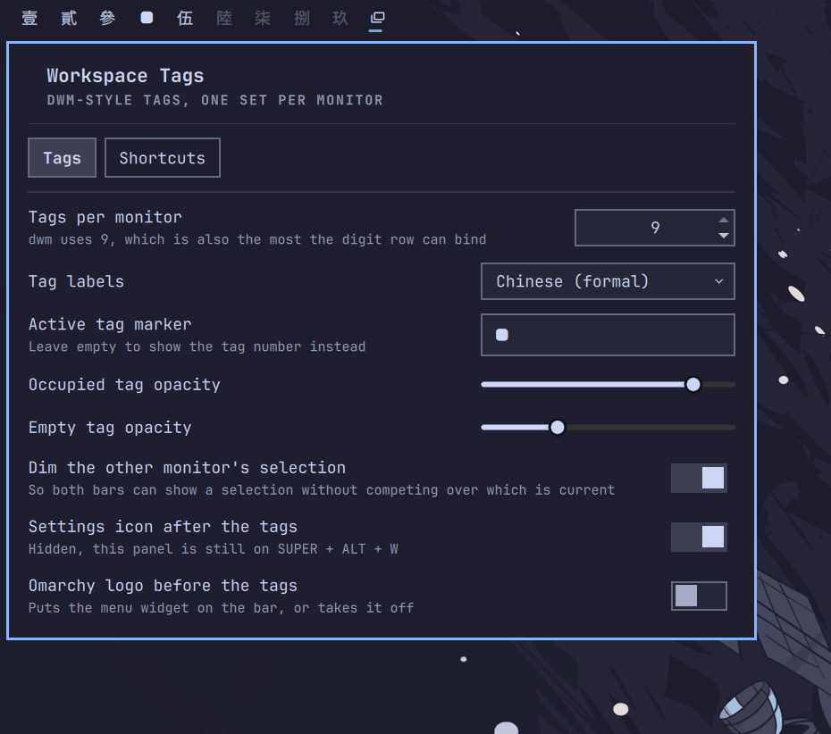

# Workspace Tags

Per-monitor workspace tags for Omarchy, in the style of dwm. A bar widget that
belongs to the monitor it is drawn on, plus an optional Hyprland config giving
each screen its own private set of tags. Configured entirely from its own
settings panel.

Omarchy's stock workspace widget lights whichever workspace is *globally*
focused, so on two monitors both bars draw the same row and one of them is
wrong:

```
                      stock                        this plugin
  left monitor    [1] 2  3  4  5              [1] 2  3  4  5  6  7  8  9
  right monitor   [1] 2  3  4  5               1  2  3  4  5 [6] 7  8  9
                   └── both bars agree,        └── each bar shows its own
                       and one of them lies        screen's tags
```



## Requirements

- Omarchy with `omarchy-shell` (Quickshell)
- Hyprland 0.56+ for per-monitor tags (Lua config API)
- A CJK font for the two Chinese label styles only

No network access, no privileged operations, no bundled binaries.

## Install

```bash
omarchy plugin add https://github.com/chagel/omarchy-workspace-tags.git --enable
```

It lands at the left of the bar and stands Omarchy's own workspace widget down
so you are not left with two rows. Move it with
`omarchy bar move chagel.workspace-tags --section center`.

**Click the icon after the tags to open settings**, or press `SUPER`+`ALT`+`W`.
Clicking a tag only ever views that tag.

The widget works on stock Omarchy as-is — each bar showing its own screen's
state. For the full dwm behaviour, turn on **Per-monitor tags** in the settings.
That appends one fenced block to your `~/.config/hypr/hyprland.lua` (backed up
first, removed again when you switch it off), which is where keybindings and
workspace rules have to live.

## Bindings

All editable in the Shortcuts tab.

| Key | dwm | Action |
|---|---|---|
| `CTRL` + `1`–`9` | `view` | Show tag N on this monitor. Asking for the tag you are on does nothing, as in dwm |
| `SUPER`+`SHIFT` + `1`–`9` | `tag` | Move the window to tag N here, and follow it |
| `SUPER`+`SHIFT`+`ALT` + `1`–`9` | `tag` | Move it there and stay put |
| `SUPER` + `[` / `]` | `focusmon` | Focus the monitor left / right |
| `SUPER`+`SHIFT` + `,` / `.` | `tagmon` | Move the window to the monitor left / right |
| `SUPER` + wheel | | Previous / next tag, wrapping within this monitor |
| `SUPER`+`ALT` + `L` | layout keys | Cycle this tag's layout: dwindle → master → scrolling |
| `SUPER`+`ALT` + `W` | | Open the settings panel |

To go back to the tag you came from, use Omarchy's own `SUPER`+`CTRL`+`Tab`
("Former workspace"). Note its "previous" is Hyprland's and therefore global —
change monitors in between and it can send you to the other screen.

All three of Omarchy's digit rows are unbound, not just the colliding ones: they
switch by *absolute* workspace, which once ids are partitioned means teleporting
to whichever monitor owns that id. Digit bindings of your own are unaffected.

## How per-monitor tags work

Each monitor gets a block of ten workspace ids, and every binding resolves a tag
against the *focused* monitor's block — so a digit key can never move focus
between screens:

| monitor | tags | workspace ids |
|---|---|---|
| leftmost | 1–9 | 1–9 |
| next | 1–9 | 11–19 |
| next | 1–9 | 21–29 |

An id reads on sight: tens digit is the monitor, units the tag, so `16` is
monitor 2's tag 6.

Monitors need no setting up — each is detected and remembered the first time it
appears, left to right, and keeps its block whether or not it is plugged in, so
unplugging one never renumbers the others. To reorder or prune, edit the
`monitors` entry in `shell.json`.

Turning it on moves existing workspaces into the block that now owns them,
windows included. To keep a window on a particular screen, renumber its
workspace into the right block first:

```bash
hyprctl dispatch 'hl.dsp.workspace.change_id({ workspace = 6, id = 16 })'
```

### Per-tag layouts

dwm's other half: each tag remembers its own arrangement. `SUPER`+`ALT`+`L`
cycles `dwindle → master → scrolling` for the tag you are on. The choice is
written where Omarchy already keeps per-workspace layouts, so its own layout
toggle and this one cannot disagree.

## Settings

| Setting | Default | |
|---|---|---|
| `tags` | `9` | Tags per monitor, 1–9 |
| `monitors` | *(detected)* | Remembered monitors, left to right. Edit `shell.json` to reorder or prune |
| `tagLabels` | `numbers` | Label style — see below |
| `showSettingsIcon` | `true` | Show the settings icon after the tags |
| `settingsGlyph` | `󱂬` | That icon's glyph |
| `activeGlyph` | `󱓻` | Marker for the active tag; empty shows its label |
| `dimUnfocusedMonitor` | `true` | Dim the selection on the monitor you are not on |
| `occupiedOpacity` | `0.85` | Opacity of tags holding windows |
| `emptyOpacity` | `0.3` | Opacity of empty tags |

Every keybinding is a setting too (`viewMods`, `moveMods`, `moveSilentMods`,
`focusMonitorLeft`/`Right`, `moveMonitorLeft`/`Right`, `nextTag`, `previousTag`,
`cycleLayout`, `openSettings`), all edited from the Shortcuts tab.

### Labels

| `tagLabels` | 1–9 |
|---|---|
| `numbers` | 1 2 3 4 5 6 7 8 9 |
| `roman` | I II III IV V VI VII VIII IX |
| `greek` | α β γ δ ε ζ η θ ι |
| `chinese` | 一 二 三 四 五 六 七 八 九 |
| `chinese-formal` | 壹 貳 參 肆 伍 陸 柒 捌 玖 |
| `letters` | A B C D E F G H I |
| `dots` | ● ● ● ● ● ● ● ● ● |

## What it writes

| | |
|---|---|
| `~/.config/omarchy/shell.json` | its own settings entry, and the bar layout when a master switch stands another widget down |
| `~/.config/hypr/hyprland.lua` | one fenced block, only while **Per-monitor tags** is on. Backed up first; nothing else touched |
| `~/.config/hypr/workspace-tags.lua` | generated config, created and owned by this plugin |
| `~/.local/state/omarchy/workspace-layouts/<id>.lua` | one line per tag whose layout you cycled |

Nothing under `~/.config/hypr` is written until you turn per-monitor tags on.

## Remove

Turn **Per-monitor tags** off first — that takes the line back out of your
`hyprland.lua` and gives Omarchy's workspace widget back. Then:

```bash
omarchy plugin remove chagel.workspace-tags
```

Removing the plugin while tags are still on leaves both behind, since nothing of
ours runs afterwards to undo them. By hand: delete the fenced `workspace-tags`
block from `hyprland.lua`, then `rm ~/.config/hypr/workspace-tags.lua`, then
`omarchy plugin enable omarchy.workspaces`.

Windows keep their ids — `16` stays `16`, now an ordinary workspace. Renumber
with `hyprctl dispatch 'hl.dsp.workspace.change_id({ workspace = 16, id = 6 })'`.

## Notes

- **The generated config is build output.** Saving in the panel rewrites it and
  reloads Hyprland; hand edits do not survive. Change the settings instead.
- **`omarchy refresh hyprland` overwrites `hyprland.lua`**, so the switch will
  read as off afterwards. `omarchy update` is safe.
- **There is deliberately no `swap_monitors` binding.** It would put a pinned id
  on the wrong screen and fight the workspace rules. Move the windows instead.

## Development

Link the plugin folder at your checkout and the QML reloads as you save it:

```bash
ln -s "$PWD" ~/.config/omarchy/plugins/chagel.workspace-tags
```

`Generator.js` does not follow — the QML engine loads a `.pragma library` once
and keeps it, so the shell has to restart before an edit takes effect. Two
scripts cover that:

```bash
scripts/apply    # restart the shell, then check the generated config matches
scripts/watch    # do it automatically as files are saved
```

```bash
node test/generator.test.js
```

Plain node, no dependencies. `Generator.js` holds everything that turns settings
into Lua and is kept free of Qt so it can be tested outside the shell.

## License

[MIT](LICENSE)
